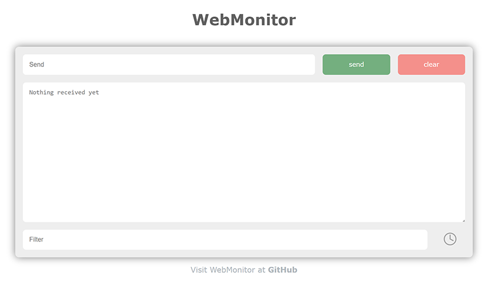
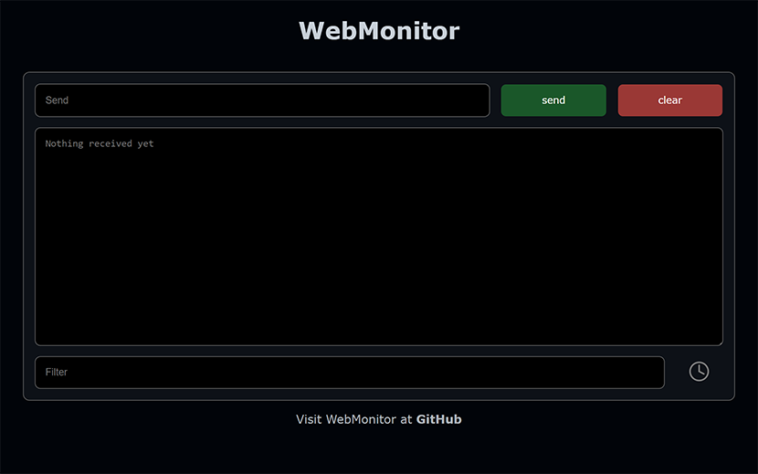
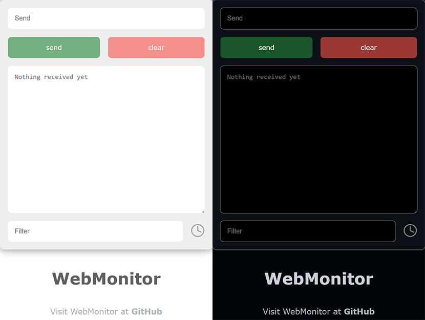
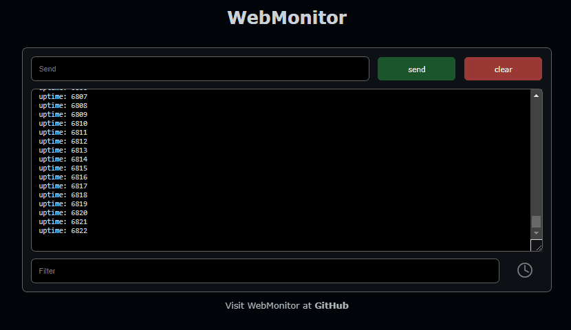

# WebMonitor for ESP8266 & ESP32

# Features
- Easy to use (same use as `Serial`)
- Multiple clients
- Automatic scrolling
- Timestamps
- Filter with RegExp support
- Responsive design (works on smartphones and tablets)

# Preview
## Light mode


## Dark mode


## Responsive


## Demo

## Installation

`platformio.ini`
```
lib_deps =
  https://github.com/sivar2311/WebMonitor
```

## Usage
WebMonitor can be used in the same way like `Serial`.<br>

```C++
  WebMonitor.println("Hello World!");
  WebMonitor.printf("Free heap: %d\r\n", ESP.getFreeHeap());
```

For detailed use, see examples:
- [basic](examples/basic/main.cpp)
- [advanced](examples/advanced/main.cpp)
- [bidirectional](examples/bidirectional/main.cpp)

