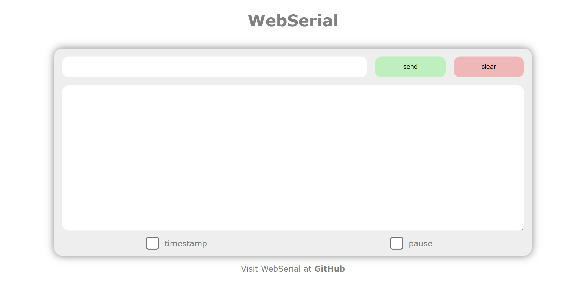

# WebSerial for ESP32
## Preview


## Features
- auto scroll
- pause
- timestamp

## Installation

`platformio.ini`
```
lib_deps =
  https://github.com/sivar2311/WebSerial
```

## Usage

See examples:
- [basic](examples/basic/main.cpp)
- [bidirectional](examples/bidirectional/main.cpp)